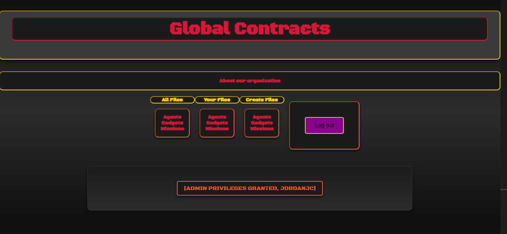
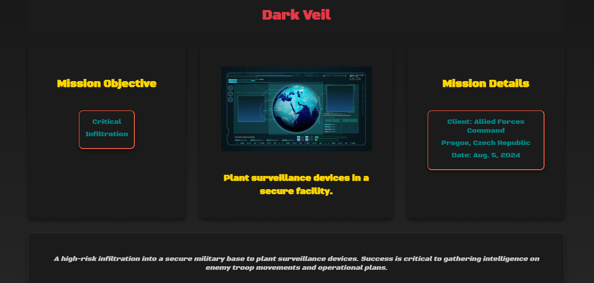
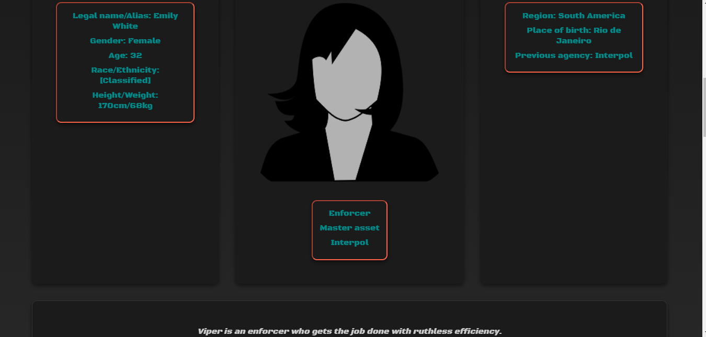

# Global Contracts

Django/Python/SQL stack project by Jordan Johnson-Carter

## About the App
**Global Contracts** is a secret agent dossier-themed website showing off files on agents, their tools, secret assignments, and other "Classified" data. Users can create an account to view more detailed data, equip agents, assign them to missions, and even create new items for the database.

I was mainly inspired by the vibe and feel of the Hitman franchise, mainly the World of Assassinatiion trilogy. I found it sleek, professional, and somewhat apathetic which gave me the idea to theme this website after secret agents.

### Links
- **Deployed App**: [Visit Global Contracts](https://global-agent-files-61c2e746393f.herokuapp.com/)
- **Planning Materials**: [View Project Plans](https://trello.com/b/1djqYj9v/project-4-django-app)

## Attributions
- **SVG Silh**: [Various images on the website came from SVG Silh, thanks!](https://svgsilh.com/)

## Technologies
- **Django**: Framework for building the user interface.
- **PostgreSQL**: Database.
- **Python 3**: Backend functionality. 

## Stretch Goals
- Allowing users to 'Grant' eachother access to modify eachother's files
- Incorporating a name/detail search bar
- Filtering by categories
- Dumping a boatload of dummy data to justify filters in the first place

